# Claude Code Agent Teams 시스템 가이드

> 출처: Claude Opus 4.6 Agent Teams 영상 분석 및 공식 가이드 종합

---

## 1. 개요

Agent Teams는 Claude Code에서 여러 AI 에이전트가 **독립 인스턴스**로 동시 실행되며, 공유 Task 시스템을 통해 소통하고 협업하는 기능이다.

### 핵심 차이: Sub-agent vs Agent Team

| 항목 | Sub-agent (심부름꾼) | Agent Team (동료) |
|------|---------------------|-------------------|
| 인스턴스 | 호출자 컨텍스트 안에서 실행 | 각자 **독립 Claude 인스턴스** |
| 컨텍스트 윈도우 | 호출자와 공유 | 각자 **독립 컨텍스트 윈도우** |
| 소통 방식 | 결과만 반환 (단방향) | **직접 메시지** 교환 (양방향) |
| 작업 방식 | 단일 작업 → 보고 → 종료 | 공유 Task 리스트에서 자율적으로 작업 |
| 협업 | 불가 | 토론, 반박, 상호 검증 가능 |
| 비용 | 저렴 | 약 **7배** (일 $6 → $40~50) |
| 적합한 상황 | 단순 작업, 단일 파일, 버그 수정 | 복잡한 병렬 개발, 다단계 워크플로 |

### 비유

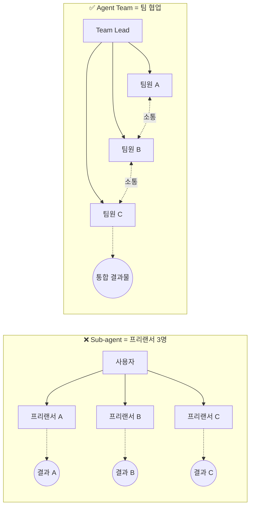

---

## 2. 아키텍처

### 2.1 팀 구성

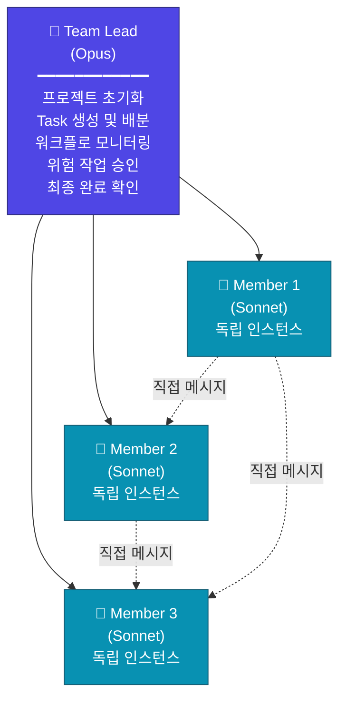

### 2.2 핵심 메커니즘

**1) 공유 Task 리스트**
- Team Lead가 `TaskCreate`로 각 멤버의 작업을 생성
- 멤버가 자율적으로 Task를 확인하고 수행
- `blockedBy` 의존성으로 실행 순서 제어

**2) 직접 메시지 (Peer Messaging)**
- 멤버끼리 직접 메시지를 보내 소통
- 토론, 반박, 상호 오류 수정 가능
- 예: QA 에이전트가 백엔드 에이전트에게 "이 테스트 실패함, 수정 필요" 전달

**3) 릴레이 실행 (Relay/Sequential)**
- `blockedBy`로 순서 강제
- 앞 작업이 완료되어야 다음 작업 시작
- 예: 분석가 완료 → 기획자 시작 → 소통 시작

**4) 병렬 실행 (Parallel)**
- 겹치지 않는 작업은 동시 실행
- 예: 프론트엔드와 백엔드 동시 개발

**5) 승인 게이트 (Approval Gates)**
- 위험/고영향 작업은 Team Lead 승인 필요
- Plan Mode Required 설정으로 강제
- 예: 인증 모듈 수정, 대규모 리팩터링

---

## 3. agent.md 파일 작성법

`agent.md`는 팀 전체를 정의하는 **단일 설계 문서**. "채용공고를 쓴다"고 생각하면 됨.

### 3.1 구조

```markdown
# 에이전트 1: [이름]

## 역할
- [구체적 업무 설명]

## 도구
- [사용할 라이브러리/기술]
- [파일 읽기/쓰기 권한]

## 규칙
- [출력 형식 규칙]
- [디자인 규칙 (상세)]
- **끝나면 다음 사람([에이전트 2 이름])한테 결과를 넘겨라** ← 필수!

---

# 에이전트 2: [이름]
...

# 에이전트 3: [이름]
...
```

### 3.2 필수 포함 요소

| 요소 | 설명 | 누락 시 결과 |
|------|------|-------------|
| 역할 정의 | 이 에이전트가 무엇을 하는지 | 작업 범위 불명확 |
| 도구/기술 명시 | 어떤 라이브러리/프레임워크 사용 | 기본 도구만 사용 |
| 디자인 규칙 | 출력물의 스타일/형식 상세 | 기본 테마, 낮은 퀄리티 |
| **핸드오프 규칙** | "끝나면 다음에게 넘겨라" | **프리랜서 모드** (각자 따로) |
| 파일 소유권 | 수정 가능 파일 범위 | 파일 충돌/덮어쓰기 |

### 3.3 예시: 데이터 분석 팀

```markdown
# 분석가 (Analyst)

## 역할
- CSV와 엑셀 데이터를 읽고 통계 분석을 돌린다
- 트렌드와 이상치, 핵심 지표를 잡아낸다

## 도구
- Python: pandas, matplotlib, seaborn, numpy
- 파일 읽기/쓰기 허용

## 차트 스타일 규칙
- 한글 폰트: 맑은 고딕 (Malgun Gothic)
- 배경: 다크 (#1a1a2e)
- 글씨: 화이트
- 메인 컬러: #0ea5e9, #22d3ee, #f59e0b
- 차트 종류: 선, 도넛, 막대
- 스파인(테두리): 전부 제거
- 막대: 둥근 모서리
- 글로우 효과 적용

## 일반 규칙
- 분석 완료 후 결과를 JSON으로 저장
- **끝나면 기획자(Strategist)에게 결과를 넘겨라**

---

# 기획자 (Strategist)

## 역할
- 분석가의 결과를 받아서 핵심 인사이트 3개를 정리한다

## 출력 형식 규칙
- 인사이트당 제목 + 설명 + 수치 근거
- insights.json으로 저장

## 일반 규칙
- **끝나면 소통 담당(Communicator)에게 결과를 넘겨라**

---

# 소통 담당 (Communicator)

## 역할
- python-pptx로 PPT 슬라이드 5장을 만든다
- 보고서 이메일 초안을 작성한다

## PPT 디자인 규칙
- 카드 UI 레이아웃
- 강조 라인 (accent line)
- 원형 배지 (circular badge)
- 배경: 다크 (#1a1a2e)
- 폰트: 맑은 고딕
- 차트 이미지: 분석가가 생성한 파일 사용

## 이메일 규칙
- 제목: "[기간] [주제] 보고"
- 본문: 핵심 수치 3개 + 인사이트 요약
```

---

## 4. 핵심 규칙 6개

### 규칙 1: 1 에이전트 = 1 역할 (One Agent, One Role)

**가장 중요한 규칙.** 하나의 에이전트에 여러 역할을 주면 결과물이 엉망이 된다.

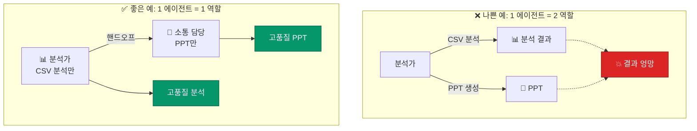

### 규칙 2: 명시적 핸드오프 (Explicit Handoff)

각 에이전트에게 "끝나면 다음 사람한테 넘겨라"를 반드시 명시해야 한다. 이게 없으면 프리랜서 3명이 따로 일하는 것과 같다.

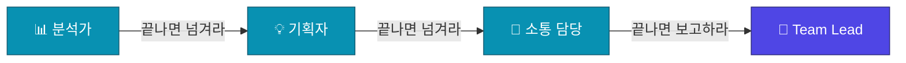

### 규칙 3: 파일 소유권 경계 (File Ownership)

두 에이전트가 같은 파일을 동시에 수정하면 충돌이 발생한다. 각 에이전트의 파일 영역을 명확히 구분해야 한다.

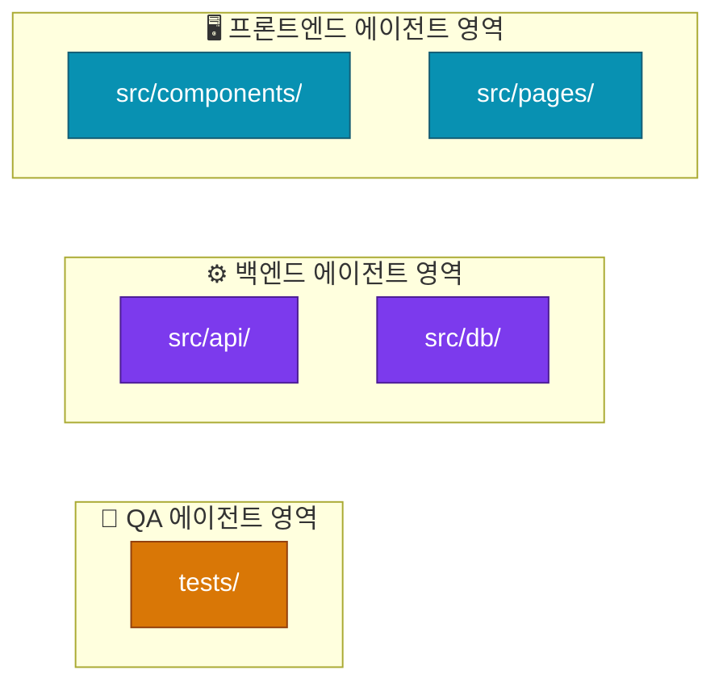

### 규칙 4: 상세한 디자인 규칙 (Design Rules)

에이전트에게 출력물의 시각적 규칙을 상세하게 정의해야 한다. 정의하지 않으면 기본 테마로 나오며 퀄리티가 크게 떨어진다.

정의해야 할 항목:
- 폰트 (한글 깨짐 방지)
- 배경색/글씨색/메인 컬러
- 차트 종류 (선, 도넛, 막대)
- UI 요소 (카드 UI, 강조 라인, 원형 배지)
- 제거할 요소 (스파인, 기본 테두리)
- 추가 효과 (글로우, 둥근 막대)

### 규칙 5: Team Lead는 실행하지 않는다 (Delegation Mode)

Team Lead가 직접 코드를 쓰거나 작업을 실행하면 병목이 생긨다. `Shift+Tab`으로 위임 모드를 활성화하여 Lead가 조정(coordination)만 하도록 강제한다.

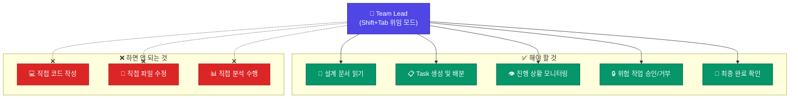

### 규칙 6: 모델 혼합으로 비용 절감 (Model Mixing)

| 역할 | 모델 | 이유 |
|------|------|------|
| Team Lead | **Opus** | 복잡한 조정, 계획, 승인 판단 필요 |
| Team Members | **Sonnet** | 실행 작업, input 토큰 비용 절감 |

일일 비용 비교:
- 전원 Opus: ~$40~50/일
- Lead=Opus + 멤버=Sonnet: 비용 대폭 절감
- 단일 AI: ~$6/일

---

## 5. 워크플로 패턴

### 5.1 릴레이 (Sequential) — 데이터 분석/보고

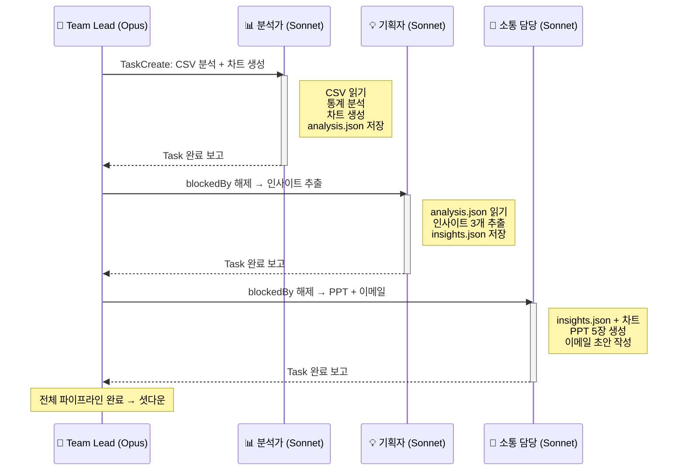

소요 시간: **약 5분** (사람이 하면 1시간+)

### 5.2 병렬 (Parallel) — 풀스택 개발

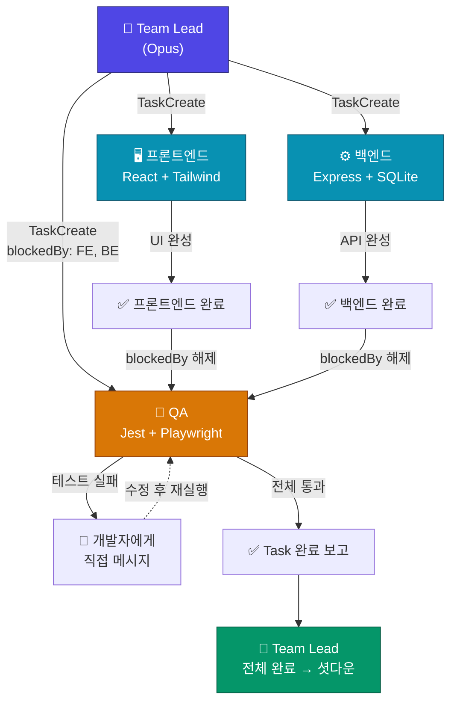

소요 시간: **수 분** (사람 팀이면 반나절)

---

## 6. 실전 적용 시나리오

### 6.1 데이터 분석 + PPT + 이메일 (릴레이)

| 단계 | 에이전트 | 입력 | 출력 |
|------|----------|------|------|
| 1 | 분석가 | sales.csv | 차트 이미지들, analysis.json |
| 2 | 기획자 | analysis.json | insights.json (인사이트 3개) |
| 3 | 소통 | insights.json + 차트 | PPT 5장 (.pptx), 이메일 초안 (.md) |

### 6.2 풀스택 앱 개발 (병렬)

| 에이전트 | 기술 스택 | 담당 파일 |
|----------|----------|----------|
| 프론트엔드 | React, Tailwind | src/components/, src/pages/ |
| 백엔드 | Express, SQLite | src/api/, src/db/ |
| QA | Jest, Playwright | tests/ |

### 6.3 적합/부적합 판단

| 적합한 경우 | 부적합한 경우 |
|------------|-------------|
| 병렬 개발 가능한 풀스택 앱 | 단일 파일 수정 |
| 반복 리포트 자동화 (주간/월간) | 단순 버그 수정 |
| 복잡한 디버깅 (다중 가설 검증) | 순차적 단순 작업 |
| 대규모 코드 리뷰/리팩터링 | 간단한 코드 리뷰 |
| 동시 리서치 (여러 주제) | 단일 질문 답변 |

---

## 7. 품질 관리 (Quality Control)

### 7.1 자동화 훅 (Quality Gates)

이벤트 트리거로 자동 테스트를 실행한다:

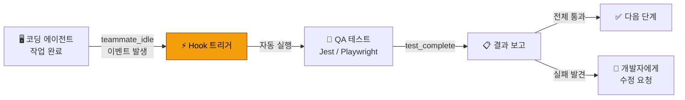

코딩 에이전트가 작업을 마치면 수동 개입 없이 즉시 테스트가 돌아간다.

### 7.2 Plan Approval (계획 승인)

위험한 작업 전 계획서를 제출하고 승인을 받아야 한다:

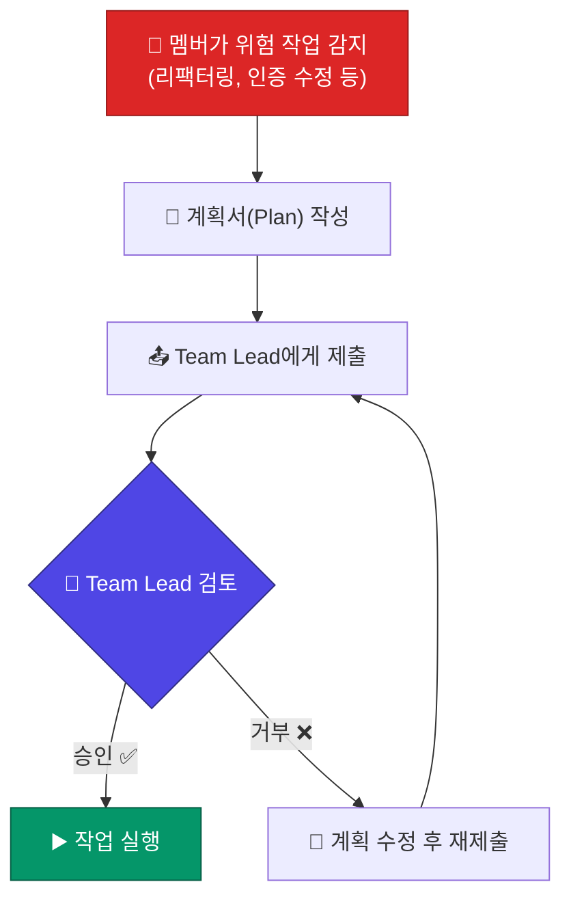

### 7.3 80/20 규칙

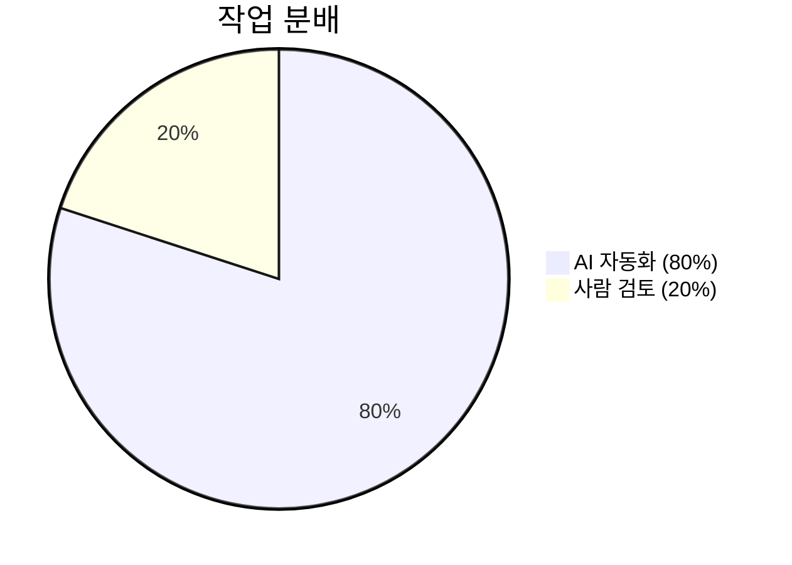

| AI가 처리 (80%) | 사람이 처리 (20%) |
|-----------------|------------------|
| 데이터 분석 | 폰트 미세 조정 |
| 차트 생성 | 레이아웃 미세 수정 |
| PPT 코딩 | 최종 검토 |
| 이메일 초안 | 발송 |

---

## 8. 비용 관리

### 일일 비용 비교

| 구성 | 예상 비용 |
|------|----------|
| 단일 Claude 사용 | ~$6/일 |
| Agent Team (전원 Opus) | ~$40~50/일 |
| Agent Team (Lead=Opus, 멤버=Sonnet) | 대폭 절감 |

### 비용 절감 전략

1. **모델 혼합**: Lead만 Opus, 나머지 Sonnet
2. **팀 사용 판단**: 단순 작업에는 단일 AI 사용
3. **스킬/플러그인**: 반복 패턴을 커스터마이징하여 토큰 절약

---

## 9. Gartner 전망

- 멀티 에이전트 시스템 관련 문의: 전년 대비 **1,445% 증가**
- 2026년 말까지 전체 엔터프라이즈 앱의 **40%**가 AI 에이전트를 포함할 것으로 예측

### AI 에이전트 진화 타임라인

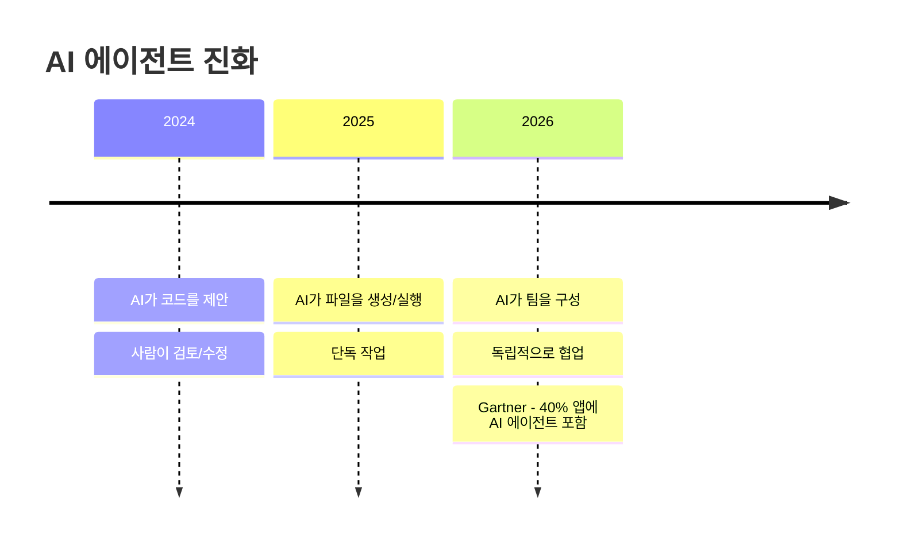

### 인간의 역할 변화

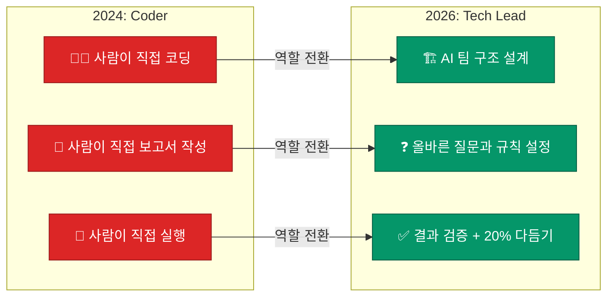
