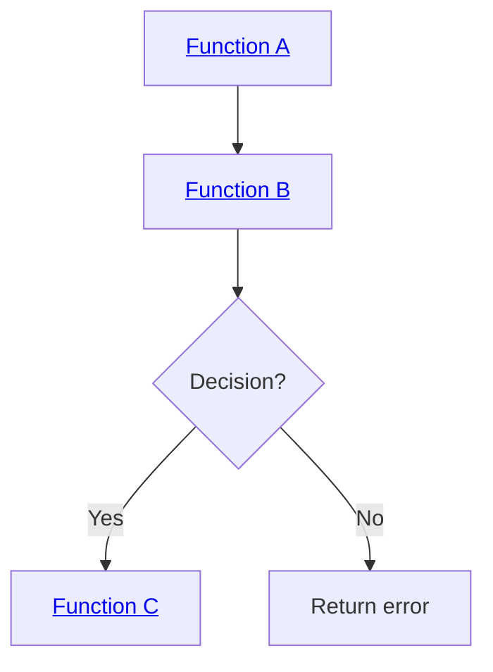
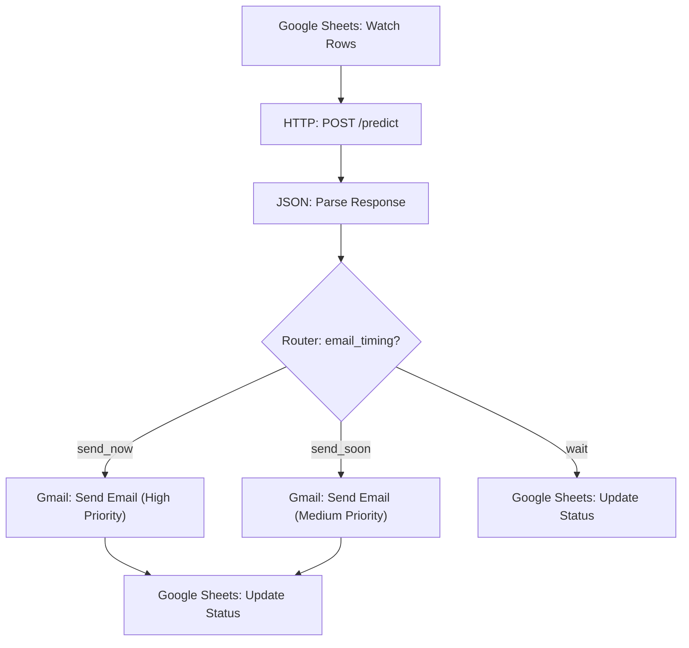
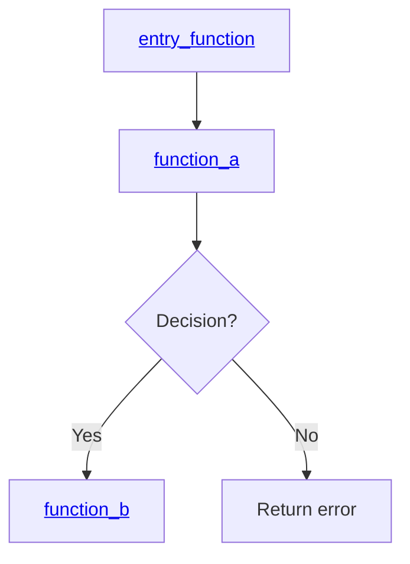

# How to Create a CodeMap Document

This guide provides comprehensive instructions for creating CodeMap documents that trace code execution flows, document business logic, and provide navigable technical documentation.

## Purpose

CodeMap documents serve as:
- **Execution flow documentation**: Trace code paths from entry point to completion
- **Architecture reference**: Show component relationships and dependencies
- **Developer onboarding**: Help new developers understand complex systems
- **Maintenance guide**: Support debugging and enhancement activities

## File Location and Naming

### Location
All CodeMap documents must be placed in:
```
docs/2-current/
```

### Naming Convention
Use the following format:
```
map-<brief-feature-name>.md
```

**Examples:**
- `map-ml-prediction-api.md`
- `map-ualr-email-routing.md`
- `map-customer-segmentation.md`

**Rules:**
- Use lowercase with hyphens
- Keep names concise but descriptive (2-5 words)
- Focus on the feature, not implementation details

---

## Document Structure

Every CodeMap document must follow this exact structure:

### 1. Title (H1)
```markdown
# Feature Name
```

### 2. Brief Description
One paragraph describing what the feature does.

### 3. Summary Section
```markdown
## Summary

The feature provides:
- Bullet point 1
- Bullet point 2
- Bullet point 3
```

### 4. Major Flow Blocks
```markdown
## Major Flow Blocks

1. **Block Name** → [`function_name()`](#section-anchor-↑-flow-diagram) ([file.py:line](../../path/to/file.py#Lline))
2. **Block Name** → [`function_name()`](#section-anchor-↑-flow-diagram) ([file.py:line](../../path/to/file.py#Lline))
```

### 5. Flow Diagram (Mermaid)
```markdown
## Flow Diagram


```

### 6. Component Call Graph
```markdown
## Component Call Graph

- [`entry_function`](#starting-trace-block-↑-flow-diagram) (Main Entry)
  - [`sub_function_1`](#sub-flow-a-↑-flow-diagram) (Sub-flow A)
    - [`helper_function_1`](#helper-section-↑-flow-diagram)
  - [`sub_function_2`](#sub-flow-b-↑-flow-diagram) (Sub-flow B)
    - [`helper_function_2`](#helper-section-↑-flow-diagram)
    - [`utility_function`](../../path/to/file.py#L123)
```

**Note:** Place immediately after Flow Diagram for quick reference.

### 7. Starting Trace Block
```markdown
---

## Starting Trace Block [[↑ Flow Diagram](#flow-diagram)]

### `function_name(parameters)`

**Location**: [file.py (start-end)](../../path/to/file.py#Lstart)

**Purpose**: Brief description

**Called by**: [Caller function](#caller-section-↑-flow-diagram) at [line X](../../path/to/file.py#LX)
*(Omit if this is the entry point)*

**Input**:
- `param1: type` - Description
- `param2: type` - Description

**Output** (return type):
- Success case: Description
- Failure case: Description

**Control Flow**:
1. [Line X](../../path/to/file.py#LX): Description → **[Sub-flow A](#sub-flow-a-↑-flow-diagram)**
2. [Line Y](../../path/to/file.py#LY): Description

**Error Cases**:
- Case 1 → outcome
- Case 2 → outcome

**Related Components**:
- Called by: [Function](#section-↑-flow-diagram)
- Calls: [Function](#section-↑-flow-diagram)
- Uses: [Component](#section-↑-flow-diagram)
- Returns to: [Function](#section-↑-flow-diagram)
```

### 8. Sub-flow Blocks
```markdown
---

## Sub-flow A: Description [[↑ Flow Diagram](#flow-diagram)]

### `function_name(parameters)`

[Same structure as Starting Trace Block]
```

### 9. Helper Functions
```markdown
---

## Helper Functions [[↑ Flow Diagram](#flow-diagram)]

### Helper A: `function_name(parameters)`

[Simplified structure - focus on purpose and logic]
```

### 10. Supporting Systems
```markdown
---

## Supporting System Name [[↑ Flow Diagram](#flow-diagram)]

### Component Name

[Document shared infrastructure, classes, utilities]
```

### 11. Configuration and Environment
```markdown
---

## Configuration and Environment [[↑ Flow Diagram](#flow-diagram)]

### Environment Variables
### Constants
```

### 12. Error Handling Summary
```markdown
---

## Error Handling Summary [[↑ Flow Diagram](#flow-diagram)]

### Error Propagation Pattern
### Main Function Error Cases
### Network Resilience (if applicable)
```

### 13. External Service Integration
```markdown
---

## External Service Integration [[↑ Flow Diagram](#flow-diagram)]

### Make.com Automation
[Document Make.com modules, triggers, routers, and data flow]

### Google Sheets
[Document sheet structure, column mappings, read/write patterns]

### ngrok Tunnel
[Document tunnel configuration, URL patterns, port mapping]
```

### 14. Business Logic Summary
```markdown
---

## Business Logic Summary [[↑ Flow Diagram](#flow-diagram)]

### Key Logic Area 1
### Key Logic Area 2
```

### 15. Dependencies
```markdown
---

## Dependencies [[↑ Flow Diagram](#flow-diagram)]

### External Libraries
### Internal Modules
### External Services
```

---

## Naming Conventions

### Section Headers

**Format:**
```markdown
## Section Name [[↑ Flow Diagram](#flow-diagram)]
```

**Anchor ID Pattern:**
- Section header: `## Starting Trace Block [[↑ Flow Diagram](#flow-diagram)]`
- Generated anchor: `#starting-trace-block-↑-flow-diagram`
- Rule: Lowercase, spaces to hyphens, include `↑-flow-diagram` suffix

**Standard Section Names:**

**Core Sections (in order):**
1. `# Feature Name` - Title
2. `## Summary` - Feature overview
3. `## Major Flow Blocks` - Quick reference list
4. `## Flow Diagram` - Mermaid visualization
5. `## Component Call Graph` - Linked hierarchy (NO back link, placed immediately after Flow Diagram)

**Detail Sections (with back links):**
6. `## Starting Trace Block [[↑ Flow Diagram](#flow-diagram)]`
7. `## Sub-flow A: Description [[↑ Flow Diagram](#flow-diagram)]`
8. `## Sub-flow B: Description [[↑ Flow Diagram](#flow-diagram)]`
9. `## Helper Functions [[↑ Flow Diagram](#flow-diagram)]`
10. `## Rate Limiting System [[↑ Flow Diagram](#flow-diagram)]` (if applicable)
11. `## Configuration and Environment [[↑ Flow Diagram](#flow-diagram)]`
12. `## Error Handling Summary [[↑ Flow Diagram](#flow-diagram)]`
13. `## External Service Integration [[↑ Flow Diagram](#flow-diagram)]`
14. `## Business Logic Summary [[↑ Flow Diagram](#flow-diagram)]`
15. `## Dependencies [[↑ Flow Diagram](#flow-diagram)]`

### Function Subsections

**Format:**
```markdown
### `function_name(param1, param2)`
```

**Do not add anchor links to function subsections** - they automatically inherit from parent section.

---

## Link Formatting Standards

### 1. File Links with Line Numbers

**Format:**
```markdown
[filename (line)](../../relative/path/to/file.py#Lline)
```

**Examples:**
```markdown
[ml_prediction_api.py (45-89)](../../ml_prediction_api.py#L45)
[Line 120](../../ml_prediction_api.py#L120)
```

**Rules:**
- Always use relative paths from the map file location
- Use `#L` prefix for line numbers
- Include line ranges in description when relevant: `(start-end)`
- Link to the start line of the range

### 2. Internal Section Links

**Format:**
```markdown
[Section Name](#section-anchor-↑-flow-diagram)
```

**Examples:**
```markdown
[Starting Trace Block](#starting-trace-block-↑-flow-diagram)
[Sub-flow A: Customer Segmentation](#sub-flow-a-customer-segmentation-↑-flow-diagram)
[Helper Functions](#helper-functions-↑-flow-diagram)
```

**Rules:**
- Always include `↑-flow-diagram` suffix
- Use full descriptive name in link text
- Anchor must match section header (lowercase, spaces to hyphens)

### 3. Function Reference Links

**Format:**
```markdown
[`function_name()`](#section-anchor-↑-flow-diagram)
```

**Examples:**
```markdown
[`predict()`](#starting-trace-block-↑-flow-diagram)
[`segment_customer()`](#sub-flow-a-customer-segmentation-↑-flow-diagram)
```

**Rules:**
- Wrap function name in backticks
- Include parentheses: `()`
- Link to the section where function is documented

### 4. Mermaid Flowchart Links

**Format:**
```markdown
A["<a href='#section-anchor-↑-flow-diagram'>Node Label</a>"]
```

**Example:**
```markdown
flowchart TD
    A["<a href='#starting-trace-block-↑-flow-diagram'>predict</a>"] --> B["<a href='#sub-flow-a-customer-segmentation-↑-flow-diagram'>segment_customer</a>"]
    B --> C{Email timing?}
    C -->|send_now| D["<a href='#sub-flow-b-email-dispatch-↑-flow-diagram'>send_email</a>"]
    C -->|wait| E[Skip customer]
```

**Rules:**
- Use HTML anchor tags inside node labels
- Single quotes around href value
- Link to function's documentation section
- Only add links to function nodes, not decision/return nodes

### 5. Back-to-Diagram Links

**Format:**
```markdown
## Section Name [[↑ Flow Diagram](#flow-diagram)]
```

**Rules:**
- Add to every major section header
- Always links to `#flow-diagram`
- Provides easy navigation back to overview

---

## Analysis Methodology

### Step 1: Identify Starting Point

Determine the entry point for the feature:
- Flask API endpoint (`@app.route`)
- Make.com trigger module (first module in blueprint JSON)
- Standalone script
- Public function

**Document:**
- Function signature
- All parameters (name, type, description)
- Return values (all possible outcomes)
- Auto-bound parameters (from context)

### Step 2: Trace Execution Flow

**For each function call:**
1. Document the exact line number where it's called
2. Link to the called function's section
3. Note what data is passed
4. Document the return value and how it's used

**Create sub-flows for:**
- Significant helper functions
- Complex logic branches
- External service calls (Make.com HTTP modules, Google Sheets API)
- ML model operations

### Step 3: Document Control Flow

**For each logical branch:**
1. List the condition (with line number)
2. Document both paths (success/failure)
3. Note any state changes
4. Track error propagation

**Example:**
```markdown
1. [Line 265-269](../../path/to/file.py#L265): If no prediction data → return error "Insufficient data for prediction"
```

### Step 4: Identify Business Logic

**Document:**
- **Input validation**: What checks are performed?
- **Transformations**: How is data modified?
- **Decision criteria**: What determines the path taken?
- **Optimization strategies**: Caching, deduplication, etc.
- **Fallback mechanisms**: What happens when primary path fails?

### Step 5: Map Dependencies

**Create three dependency categories:**

1. **External Libraries**: Third-party packages
   - List where each is used
   - Link to usage locations

2. **Internal Modules**: Project code
   - Show import relationships
   - Link to function calls

3. **External Services**: Make.com, Google Sheets, ngrok
   - Document API/service dependencies
   - Note configuration requirements

### Step 6: Document Error Handling

**For each function:**
1. List all exception types caught
2. Document error return values
3. Show error propagation path
4. Note logging behavior

**Create summary sections for:**
- Error propagation patterns
- Retry logic
- Graceful degradation
- User-facing error messages

---

## Writing Style Guidelines

### Be Precise

**Good:**
```markdown
[Line 120](../../ml_prediction_api.py#L120): Call [`segment_customer()`](#sub-flow-a-↑-flow-diagram) → **[Sub-flow A](#sub-flow-a-↑-flow-diagram)**
```

**Bad:**
```markdown
Calls the segmentation function somewhere around line 120
```

### Use Consistent Terminology

- **Call**: Function invocation
- **Return**: Function completion with value
- **Invoke**: External service/API call
- **Execute**: Command or query execution
- **Process**: Data transformation

### Document All Paths

For every decision point, document:
- **Condition**: What triggers each path
- **Action**: What happens on each path
- **Outcome**: Where control flow goes next

### Link Everything

Create a web of connections:
- Every function mention → link to its section
- Every line reference → link to source code
- Every related component → link to its section
- Every major section → link back to flow diagram

---

## Control Flow Documentation Patterns

### Pattern 1: Sequential Steps

```markdown
**Control Flow**:
1. [Line X](../../file.py#LX): Action 1
2. [Line Y](../../file.py#LY): Action 2
3. [Line Z](../../file.py#LZ): Action 3
```

### Pattern 2: Branching Logic

```markdown
**Control Flow**:
1. [Line X](../../file.py#LX): Check condition
2. [Line Y](../../file.py#LY): If true → path A
3. [Line Z](../../file.py#LZ): If false → path B
```

### Pattern 3: Loop Iteration

```markdown
**Control Flow**:
1. [Line X](../../file.py#LX): Iterate through items:
   - [Line Y](../../file.py#LY): Process each item
   - [Line Z](../../file.py#LZ): If condition → break/continue
2. [Line W](../../file.py#LW): After loop completes
```

### Pattern 4: Try-Except Blocks

```markdown
**Control Flow**:
1. [Line X](../../file.py#LX): Try operation
2. [Line Y-Z](../../file.py#LY): If successful → process result
3. [Line W](../../file.py#LW): Catch exception → handle error
4. [Line V](../../file.py#LV): Finally block cleanup
```

### Pattern 5: Function Call Chain

```markdown
**Control Flow**:
1. [Line X](../../file.py#LX): Call [`function_a()`](#section-a-↑-flow-diagram) → **[Sub-flow A](#section-a-↑-flow-diagram)**
2. [Line Y](../../file.py#LY): Use result from A, call [`function_b()`](#section-b-↑-flow-diagram) → **[Sub-flow B](#section-b-↑-flow-diagram)**
3. [Line Z](../../file.py#LZ): Return combined result
```

---

## Component Relationship Documentation

### "Called by" Section

**Purpose**: Show which function invokes this one

**Format:**
```markdown
**Called by**: [`parent_function()`](#parent-section-↑-flow-diagram) at [line X](../../file.py#LX)
```

**Omit if**: This is the entry point (no caller)

### "Calls" Section

**Purpose**: List all functions this one invokes

**Format:**
```markdown
**Calls**: [`func_a()`](#section-a-↑-flow-diagram), [`func_b()`](#section-b-↑-flow-diagram)
```

### "Uses" Section

**Purpose**: Reference shared components/infrastructure

**Format:**
```markdown
**Uses**: [Component Name](#component-section-↑-flow-diagram)
```

**Examples:**
- [External Service Integration](#external-service-integration-↑-flow-diagram)
- [Configuration](#configuration-and-environment-↑-flow-diagram)

### "Returns to" Section

**Purpose**: Show where control returns after completion

**Format:**
```markdown
**Returns to**: [`parent_function()`](#parent-section-↑-flow-diagram) at [line X](../../file.py#LX)
```

### "Related Components" Section

**Purpose**: Combine all relationships in one place

**Format:**
```markdown
**Related Components**:
- Called by: [`parent()`](#parent-section-↑-flow-diagram) at [line X](../../file.py#LX)
- Calls: [`child_a()`](#child-a-section-↑-flow-diagram), [`child_b()`](#child-b-section-↑-flow-diagram)
- Uses: [System Name](#system-section-↑-flow-diagram)
- Returns to: [`parent()`](#parent-section-↑-flow-diagram)
```

---

## Mermaid Flowchart Best Practices

### Flowchart Type

Always use `flowchart TD` (top-down):
```mermaid
flowchart TD
```

### Node Types

**Function/Action Nodes:**
```mermaid
A["<a href='#section-↑-flow-diagram'>Function Name</a>"]
```

**Decision Nodes:**
```mermaid
B{Decision Question?}
```

**Return/End Nodes:**
```mermaid
C[Return value or End state]
```

### Edge Labels

**For decision branches:**
```mermaid
C -->|Yes| D
C -->|No| E
```

**For descriptive flow:**
```mermaid
A --> B
B --> C
```

### Flowchart Organization

1. **Entry point** at top
2. **Main flow** down the center
3. **Error paths** to the sides
4. **Helper functions** as branches
5. **Exit points** at bottom

### Keep It Readable

- Limit to 15-25 nodes
- Use clear, concise labels
- Align similar-level nodes
- Show major decision points only
- Omit trivial branches

---

## Input/Output Documentation

### Input Parameters

**Format:**
```markdown
**Input**:
- `param_name: type` - Description
- `optional_param: type | None` - Description (optional/default: value)
- `context_param: type` - Description (auto-bound from context)
```

**Example:**
```markdown
**Input**:
- `customer_data: dict` - Customer purchase history (days_since_purchase, total_purchases, avg_amount)
- `preferred_category: str` - Product category (Electronics, Fashion, Beauty, Home & Garden, Sports)
- `timeout: int` - Request timeout in seconds (default: 30)
```

### Output Documentation

**Format:**
```markdown
**Output** (return_type):
- Success case: Description
  - `field1: type` - Description
  - `field2: type` - Description
- Failure case: Description
  - `error: str` - Error message
```

**Example:**
```markdown
**Output** (dict):
- Success case:
  - `predicted_days: float` - Days until next purchase
  - `confidence: float` - Prediction confidence (0.6-0.9)
  - `segment: str` - Customer segment (VIP, Premium, Regular, Growing, New)
  - `email_timing: str` - send_now, send_soon, or wait
- Failure case:
  - `error: str` - Error description
```

### Complex Return Types

For nested structures:
```markdown
**Output** (dict):
- `predicted_days: float` - Days until next purchase
- `recommendations: list[dict]` - Product recommendations
  - `name: str` - Product name
  - `category: str` - Product category
- `customer_segment: str` - Segment classification
- `email_timing: str` - When to send email
```

---

## Error Case Documentation

### Format

```markdown
**Error Cases**:
- Condition 1 → Outcome (line reference)
- Condition 2 → Outcome (line reference)
- Exception type → Handling approach (line reference)
```

### Example

```markdown
**Error Cases**:
- Missing required fields → Return 400 Bad Request ([line 85](../../ml_prediction_api.py#L85))
- Invalid category → Default to "General" ([line 102](../../ml_prediction_api.py#L102))
- ML model not trained → Return 500 Internal Error ([line 45](../../ml_prediction_api.py#L45))
- JSON parse error → Return 400 with error message ([line 78](../../ml_prediction_api.py#L78))
```

### Categories

Group errors by type:
1. **Validation Errors**: Invalid input
2. **Network Errors**: Connection/timeout issues
3. **Data Errors**: Missing/malformed data
4. **System Errors**: ML model/service issues
5. **Business Logic Errors**: State/permission violations

---

## API/External Service Documentation

### API Call Format

```markdown
**API Details**:
- Endpoint: `domain.com/path`
- Method: GET/POST/etc.
- Parameters ([line X](../../file.py#LX)):
  - `param1: value` - Description
  - `param2: value` - Description
- Headers ([line Y](../../file.py#LY)):
  - `Header-Name: value`
- Authentication: Description
```

### Example

```markdown
**API Details**:
- Endpoint: `http://localhost:8080/predict`
- Method: POST
- Parameters ([line 80-90](../../ml_prediction_api.py#L80)):
  - `days_since_purchase: int` - Days since last purchase
  - `total_purchases: int` - Lifetime purchase count
  - `avg_purchase_amount: float` - Average order value
  - `preferred_category: str` - Product category
- Headers:
  - `Content-Type: application/json`
- Authentication: None (local API)
```

---

## Make.com Blueprint Documentation

### Blueprint Flow Mapping

For Make.com automation blueprints, create code-maps that document the module chain:

**Format:**
```markdown
## Blueprint Flow: [Scenario Name] [[↑ Flow Diagram](#flow-diagram)]

### Module Chain

| Order | Module ID | Type | Purpose |
|-------|-----------|------|---------|
| 1 | N | Google Sheets: Watch Rows | Trigger - new customer data |
| 2 | N+1 | HTTP: Make a Request | POST to ML API |
| 3 | N+2 | JSON: Parse JSON | Parse prediction response |
| 4 | N+3 | Router | Branch by email_timing |

### Router Conditions

| Route | Filter | Condition |
|-------|--------|-----------|
| Route 1 | send_now | `{{N+2.email_timing}}` equals "send_now" |
| Route 2 | send_soon | `{{N+2.email_timing}}` equals "send_soon" |

### Variable Mappings

| Variable | Source Module | Target Module | Field |
|----------|-------------|---------------|-------|
| `{{1.customer_name}}` | Google Sheets | Email | To Name |
| `{{3.predicted_days}}` | JSON Parse | Email | Body variable |
```

### Mermaid for Blueprints

```markdown

```

---

## External Service Operations Documentation

### Google Sheets Integration

```markdown
**Google Sheets Details** ([blueprint module N]):
- Spreadsheet: [Sheet Name]
- Sheet: [Tab Name]
- Operation: Watch Rows / Search Rows / Update Row / Add Row
- Key Columns:
  - A: customer_id
  - B: customer_email
  - C: customer_name
  - ...
- Filter: [condition if any]
```

### ngrok Tunnel

```markdown
**ngrok Configuration**:
- Local Port: 8080 (Flask API)
- Public URL: `https://<random>.ngrok-free.app`
- Note: URL changes on each ngrok restart; update Make.com HTTP module URL accordingly
```

---

## Business Logic Documentation

### Decision Logic

**Format:**
```markdown
### Logic Area Name

**Strategy**: Brief description

**Implementation**:
1. Step 1 - [Function](#section-↑-flow-diagram)
2. Step 2 - [Function](#section-↑-flow-diagram)
3. Step 3 - [Function](#section-↑-flow-diagram)

**Rationale**: Why this approach was chosen
```

### Example

```markdown
### Customer Segmentation Strategy

**Strategy**: Tier-based segmentation using purchase history

**Implementation**:
1. Check VIP criteria - [`segment_customer()`](#sub-flow-a-customer-segmentation-↑-flow-diagram) [line 130-135](../../ml_prediction_api.py#L130)
2. Check Premium criteria - [line 136-140](../../ml_prediction_api.py#L136)
3. Check Regular criteria - [line 141-145](../../ml_prediction_api.py#L141)
4. Default to Growing/New - [line 146-150](../../ml_prediction_api.py#L146)

**Rationale**:
- VIP: 20+ purchases, $200+ average → highest engagement
- Premium: 15+ purchases, $150+ average → strong retention
- Regular: 10+ purchases → consistent buyer
- Growing: 5+ purchases → emerging customer
- New: <5 purchases → recent acquisition
```

### Priority/Fallback Logic

```markdown
### Email Timing Priority

1. **send_now**: Predicted purchase within 3 days - see [`determine_timing()`](#section-a-↑-flow-diagram)
2. **send_soon**: Predicted purchase within 7 days - see [`determine_timing()`](#section-a-↑-flow-diagram)
3. **wait**: Predicted purchase beyond 7 days - skip email
```

---

## Component Call Graph

### Format

Use **markdown bullet lists with links** to create a navigable hierarchy:

```markdown
## Component Call Graph

- [`entry_function`](#starting-trace-block-↑-flow-diagram) (Main Entry)
  - [`sub_function_1`](#sub-flow-a-↑-flow-diagram) (Sub-flow A)
    - [`helper_1`](#helper-section-↑-flow-diagram)
  - [`sub_function_2`](#sub-flow-b-↑-flow-diagram) (Sub-flow B)
    - [`helper_2`](#helper-section-↑-flow-diagram)
    - [`utility_function`](../../path/to/file.py#L123)
```

### Rules

- **Place immediately after Flow Diagram** (do NOT add `[[↑ Flow Diagram]` back link)
- Use markdown bullet lists (dash + space + indent)
- **Wrap all function names in backticks and link them**
- Link to internal sections using anchor format: `#section-name-↑-flow-diagram`
- Link to external utility functions using file path: `../../path/to/file.py#L123`
- Show 2-3 levels of depth maximum
- Add role labels in parentheses: `(Main Entry)`, `(Sub-flow A)`, `(Helper B1)`
- Indent with 2 spaces per level

### Link Types

**1. Main functions documented in map:**
```markdown
- [`function_name`](#section-anchor-↑-flow-diagram) (Role Label)
```

**2. External/utility functions:**
```markdown
- [`utility_function`](../../path/to/file.py#L123)
```

**3. Repeated function (no new section):**
```markdown
- [`get_model().predict()`](#predict-lines-45-60)
```

### Example

```markdown
## Component Call Graph

- [`predict`](#starting-trace-block-↑-flow-diagram) (Main Entry - POST /predict)
  - [`validate_input`](#sub-flow-a-input-validation-↑-flow-diagram) (Sub-flow A)
  - [`run_prediction`](#sub-flow-b-ml-prediction-↑-flow-diagram) (Sub-flow B)
    - [`model.predict()`](../../ml_prediction_api.py#L95) (scikit-learn)
  - [`segment_customer`](#sub-flow-c-customer-segmentation-↑-flow-diagram) (Sub-flow C)
  - [`get_recommendations`](#sub-flow-d-product-recommendations-↑-flow-diagram) (Sub-flow D)
  - [`determine_timing`](#sub-flow-e-email-timing-↑-flow-diagram) (Sub-flow E)
```

### Benefits

- **Clickable navigation**: Jump directly to any function's documentation
- **Quick overview**: See entire call hierarchy at a glance
- **Context preservation**: Role labels clarify each function's purpose
- **External tracking**: Links to utility functions show dependencies

---

## Quality Checklist

Before publishing a CodeMap, verify:

### Structure
- [ ] Title (H1) is clear and descriptive
- [ ] Summary section exists with bullet points
- [ ] Major Flow Blocks listed with links
- [ ] Flow Diagram (Mermaid) includes all major paths
- [ ] All major sections present and ordered correctly
- [ ] Component Call Graph included

### Navigation
- [ ] All section headers include `[[↑ Flow Diagram](#flow-diagram)]`
- [ ] All function names link to their sections
- [ ] All line numbers link to source code
- [ ] All internal references use correct anchor format
- [ ] Mermaid nodes link to documentation sections
- [ ] No broken links

### Content
- [ ] Entry point clearly identified
- [ ] All parameters documented with types
- [ ] Return values documented for all cases
- [ ] Control flow documented line-by-line
- [ ] Error cases comprehensively covered
- [ ] Business logic explained with rationale
- [ ] External dependencies documented

### Links
- [ ] All file links use relative paths
- [ ] All file links include line numbers (#L)
- [ ] All section anchors include `↑-flow-diagram` suffix
- [ ] Function references wrapped in backticks
- [ ] Bidirectional links (called by / returns to)

### Style
- [ ] Consistent terminology throughout
- [ ] Precise line number references
- [ ] Clear, concise descriptions
- [ ] Professional technical writing
- [ ] No ambiguous statements

---

## Template

Use this template to start a new CodeMap:

```markdown
# Feature Name

Brief description of what this feature does (1-2 sentences).

## Summary

The feature provides:
- Key capability 1
- Key capability 2
- Key capability 3

## Major Flow Blocks

1. **Main Entry** → [`entry_function()`](#starting-trace-block-↑-flow-diagram) ([file.py:line](../../path/to/file.py#Lline))
2. **Sub-process A** → [`function_a()`](#sub-flow-a-description-↑-flow-diagram) ([file.py:line](../../path/to/file.py#Lline))
3. **Sub-process B** → [`function_b()`](#sub-flow-b-description-↑-flow-diagram) ([file.py:line](../../path/to/file.py#Lline))

## Flow Diagram



---

## Starting Trace Block [[↑ Flow Diagram](#flow-diagram)]

### `entry_function(param1, param2)`

**Location**: [file.py (start-end)](../../path/to/file.py#Lstart)

**Purpose**: Brief description

**Input**:
- `param1: type` - Description
- `param2: type` - Description

**Output** (return_type):
- Success case: Description
- Failure case: Description

**Control Flow**:
1. [Line X](../../path/to/file.py#LX): Description
2. [Line Y](../../path/to/file.py#LY): Description

**Error Cases**:
- Case 1 → outcome
- Case 2 → outcome

**Related Components**:
- Calls: [`function_a()`](#sub-flow-a-description-↑-flow-diagram)
- Uses: [System](#system-name-↑-flow-diagram)

---

## Sub-flow A: Description [[↑ Flow Diagram](#flow-diagram)]

### `function_a(param)`

[Repeat structure from Starting Trace Block]

---

## Helper Functions [[↑ Flow Diagram](#flow-diagram)]

### Helper A: `helper_function(param)`

[Simplified documentation]

---

## Configuration and Environment [[↑ Flow Diagram](#flow-diagram)]

### Environment Variables
### Constants

---

## Error Handling Summary [[↑ Flow Diagram](#flow-diagram)]

### Error Propagation Pattern
### Main Function Error Cases

---

## External Service Integration [[↑ Flow Diagram](#flow-diagram)]

### Make.com Integration
### Google Sheets Integration
### ngrok Configuration

---

## Business Logic Summary [[↑ Flow Diagram](#flow-diagram)]

### Logic Area 1
### Logic Area 2

---

## Dependencies [[↑ Flow Diagram](#flow-diagram)]

### External Libraries
### Internal Modules
### External Services

---

## Component Call Graph [[↑ Flow Diagram](#flow-diagram)]

```
entry_function (Main Entry)
├─→ function_a (Sub-flow A)
│   └─→ helper_1
└─→ function_b (Sub-flow B)
    └─→ helper_2
```
```

---

## Tools and Automation

### Generating Mermaid Diagrams

Use online tools:
- [Mermaid Live Editor](https://mermaid.live/)
- VS Code Mermaid extensions

### Link Validation

Run link checker before publishing:
```bash
# Check for broken internal links
grep -o '#[a-z-]*-↑-flow-diagram' docs/2-current/map-*.md | sort | uniq
```

### Line Number Updates

When code changes, update line numbers:
1. Search for file references: `grep "file.py#L" docs/2-current/map-*.md`
2. Verify each line number is still accurate
3. Update as needed

---

## Maintenance

### When to Update

Update CodeMaps when:
- Function signatures change
- Control flow changes significantly
- New error cases added
- Business logic modified
- Dependencies change

### Version Control

- Commit CodeMaps with related code changes
- Include map updates in pull requests
- Note map changes in commit messages

### Review Process

During code review, verify:
- CodeMap accurately reflects implementation
- All new functions documented
- Links point to correct locations
- No outdated information

---

## Common Pitfalls

### Avoid These Mistakes

1. **Missing `↑-flow-diagram` suffix in anchors**
   - Bad: `#starting-trace-block`
   - Good: `#starting-trace-block-↑-flow-diagram`

2. **Absolute paths instead of relative**
   - Bad: `/c/Users/kbupw/Desktop/Projects/Make_project/ml_prediction_api.py`
   - Good: `../../ml_prediction_api.py`

3. **Missing line numbers in file links**
   - Bad: `[file.py](../../path/to/file.py)`
   - Good: `[file.py (line)](../../path/to/file.py#Lline)`

4. **Inconsistent section naming**
   - Bad: `## Sub Flow A`
   - Good: `## Sub-flow A: Description [[↑ Flow Diagram](#flow-diagram)]`

5. **Broken bidirectional links**
   - Always include both "Called by" and "Returns to"
   - Verify links point to correct sections

6. **Vague descriptions**
   - Bad: "Processes data"
   - Good: "Trains RandomForestRegressor on purchase history (line 45-67)"

7. **Missing Mermaid links**
   - Link all function nodes to their sections
   - Keep decision nodes unlinked

8. **Outdated line numbers**
   - Verify line numbers after code changes
   - Update affected links

---

## Advanced Techniques

### Documenting Make.com Blueprint Flows

For Make.com automation scenarios:
```markdown
**Blueprint Flow**:
1. **Trigger**: Google Sheets Watch Rows (Module 1) - polls every 15 min
2. **HTTP Module**: POST to Flask API (Module 2) - sends customer data
3. **JSON Parse**: Extract prediction fields (Module 3)
4. **Router**: Branch by `email_timing` (Module 4)
   - Route 1 (send_now): Gmail Send Email + Update Sheet
   - Route 2 (send_soon): Gmail Send Email + Update Sheet
   - Route 3 (wait): Update Sheet only
```

### Documenting ML Pipeline Flows

```markdown
**Control Flow**:
1. [Line X](../../ml_prediction_api.py#LX): Load training data from CSV
2. [Line Y](../../ml_prediction_api.py#LY): Extract features (days_since, total_purchases, avg_amount)
3. [Line Z](../../ml_prediction_api.py#LZ): Train RandomForestRegressor
4. [Line W](../../ml_prediction_api.py#LW): Predict on new customer data
5. [Line V](../../ml_prediction_api.py#LV): Post-process: add confidence, segment, recommendations
```

### Documenting HTML Email Template Structure

```markdown
**Template Variables**:
- `{{customer_name}}` - Personalized greeting
- `{{predicted_days}}` - Days until predicted purchase
- `{{recommended_products}}` - Category-specific product list
- `{{confidence_score}}` - Prediction confidence percentage

**Template Sections**:
1. Header with logo and brand colors
2. Personalized greeting
3. Product recommendations grid
4. Quick stats sidebar
5. CTA button
6. Footer with unsubscribe
```

---

## Summary

Creating effective CodeMaps requires:
1. **Systematic analysis** of code execution
2. **Precise documentation** of control flow
3. **Comprehensive linking** between components
4. **Consistent formatting** across documents
5. **Regular maintenance** as code evolves

Follow this guide to create CodeMaps that serve as valuable technical documentation and aid in system understanding, maintenance, and enhancement.
